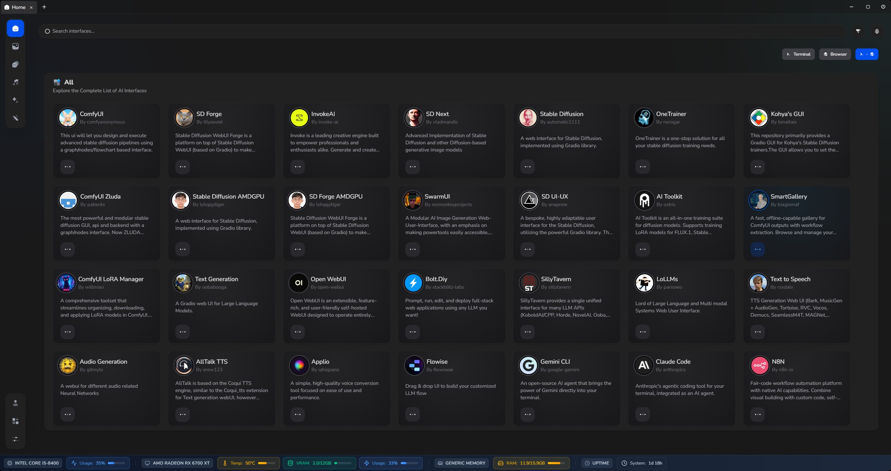

# [LynxHub](https://github.com/KindaBrazy/LynxHub) Local AI Collection

A collection of local AI tools with **full support** for **arguments**, **configurations**, and **extensions**.

## 🚀 Available Modules

### 🖼️ Image Generation

| Developer                                                                                          | Project                                                                                 |
| -------------------------------------------------------------------------------------------------- | --------------------------------------------------------------------------------------- |
|  ComfyAnonymous  | [ComfyUI](https://github.com/comfyanonymous/ComfyUI)                                    |
|  Patientx          | [ComfyUI Zluda](https://github.com/patientx/ComfyUI-Zluda)                              |
|  InvokeAI        | [InvokeAI](https://github.com/invoke-ai/InvokeAI)                                       |
|  Automatic1111    | [Stable Diffusion](https://github.com/AUTOMATIC1111/stable-diffusion-webui)             |
|  Lshqqytiger      | [Stable Diffusion AMDGPU](https://github.com/lshqqytiger/stable-diffusion-webui-amdgpu) |
|  Lllyasviel        | [SD Forge](https://github.com/lllyasviel/stable-diffusion-webui-forge)                  |
|  Lshqqytiger      | [SD Forge AMDGPU](https://github.com/lshqqytiger/stable-diffusion-webui-amdgpu-forge)   |
|  Vladmandic       | [SD Next](https://github.com/vladmandic/automatic)                                      |
|  McMonkeyProjects | [SwarmUI](https://github.com/mcmonkeyprojects/SwarmUI)                                  |
|  Anapnoe         | [SD UI-UX](https://github.com/anapnoe/stable-diffusion-webui-ux)                        |

### 📝 Text Generation

| Developer                                                                                          | Project                                                               |
| -------------------------------------------------------------------------------------------------- | --------------------------------------------------------------------- |
|  Oobabooga       | [Text Generation](https://github.com/oobabooga/text-generation-webui) |
|  SillyTavern     | [SillyTavern](https://github.com/SillyTavern/SillyTavern)             |
|  Open-WebUI      | [Open WebUI](https://github.com/open-webui/open-webui)                |
|  StackBlitz Labs | [bolt.diy](https://github.com/stackblitz-labs/bolt.diy)               |
|  ParisNeo           | [LoLLMs](https://github.com/ParisNeo/lollms-webui)                    |

### 🎵 Audio Generation

| Developer                                                                                 | Project                                                           |
| ----------------------------------------------------------------------------------------- | ----------------------------------------------------------------- |
|  Rsxdalv  | [Text to Speech](https://github.com/rsxdalv/tts-generation-webui) |
|  Gitmylo | [Audio Generation](https://github.com/gitmylo/audio-webui)        |
|  Erew123 | [AllTalk TTS](https://github.com/erew123/alltalk_tts)             |

### 🤖 Agents

| Developer                                                                                        | Project                                                   |
| ------------------------------------------------------------------------------------------------ | --------------------------------------------------------- |
|  FlowiseAI     | [Flowise](https://github.com/FlowiseAI/Flowise)           |
|  google-gemini | [gemini-cli](https://github.com/google-gemini/gemini-cli) |
|  n8n-io         | [n8n](https://github.com/n8n-io/n8n)                      |

### Tools

| Developer                                                                                    | Project                                                                        |
| -------------------------------------------------------------------------------------------- | ------------------------------------------------------------------------------ |
|  ostris     | [AI Toolkit](https://github.com/ostris/ai-toolkit)                             |
|  biagiomaf | [SmartGallery for ComfyUI](https://github.com/biagiomaf/smart-comfyui-gallery) |
|  willmiao   | [ComfyUI LoRA Manager](https://github.com/willmiao/ComfyUI-Lora-Manager)       |
|  Nerogar           | [OneTrainer](https://github.com/Nerogar/OneTrainer)                                     |
|  Bmaltais          | [Kohya's GUI](https://github.com/bmaltais/kohya_ss)                                     |
