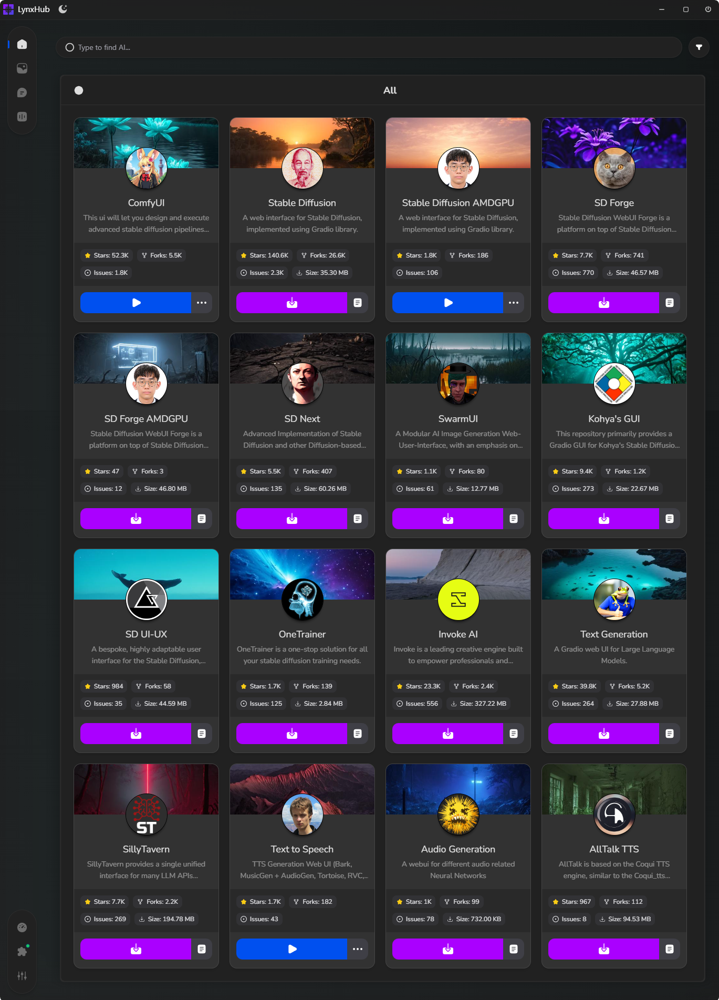

# [LynxHub](https://github.com/KindaBrazy/LynxHub) WebUI Container Module

A comprehensive collection of WebUI modules featuring **full support** for **arguments and configurations**.

## 🚀 Available Modules

### 🖼️ Image Generation

| Developer                                                                                          | Description                                        | GitHub                                                                     |
|----------------------------------------------------------------------------------------------------|----------------------------------------------------|----------------------------------------------------------------------------|
|  ComfyAnonymous  | ComfyUI                                            | [Link](https://github.com/comfyanonymous/ComfyUI)                          |
|  Automatic1111    | Stable Diffusion web UI                            | [Link](https://github.com/AUTOMATIC1111/stable-diffusion-webui)            |
|  Lshqqytiger      | Stable Diffusion web UI for AMDGPUs                | [Link](https://github.com/lshqqytiger/stable-diffusion-webui-amdgpu)       |
|  Lshqqytiger      | Stable Diffusion WebUI AMDGPU Forge                | [Link](https://github.com/lshqqytiger/stable-diffusion-webui-amdgpu-forge) |
|  Lllyasviel        | Stable Diffusion WebUI Forge                       | [Link](https://github.com/lllyasviel/stable-diffusion-webui-forge)         |
|  Vladmandic       | SD.Next                                            | [Link](https://github.com/vladmandic/automatic)                            |
|  McMonkeyProjects | SwarmUI                                            | [Link](https://github.com/mcmonkeyprojects/SwarmUI)                        |
|  Bmaltais          | Kohya's GUI                                        | [Link](https://github.com/bmaltais/kohya_ss)                               |
|  Anapnoe         | Stable Diffusion web UI-UX                         | [Link](https://github.com/anapnoe/stable-diffusion-webui-ux)               |
|  Nerogar           | OneTrainer (Available in LynxHub V1.3.0 and above) | [Link](https://github.com/Nerogar/OneTrainer)                              |

### 📝 Text Generation

| Developer                                                                                      | Description            | GitHub                                                     |
|------------------------------------------------------------------------------------------------|------------------------|------------------------------------------------------------|
|  Oobabooga   | Text generation web UI | [Link](https://github.com/oobabooga/text-generation-webui) |
|  SillyTavern | SillyTavern            | [Link](https://github.com/SillyTavern/SillyTavern)         |

### 🎵 Audio Generation

| Developer                                                                                 | Description          | GitHub                                                  |
|-------------------------------------------------------------------------------------------|----------------------|---------------------------------------------------------|
|  Rsxdalv  | TTS Generation WebUI | [Link](https://github.com/rsxdalv/tts-generation-webui) |
|  Gitmylo | Audio Webui          | [Link](https://github.com/gitmylo/audio-webui)          |

> [!Note]
>
> More modules are in development. Stay tuned for updates!

## 📊 Module Statistics

| Category         | Number of Modules |
|------------------|-------------------|
| **Overall**      | **14**            |
| Image Generation | 10                |
| Text Generation  | 2                 |
| Audio Generation | 2                 |

## 🔍 Explore More

Discover additional modules in the **[LynxHub](https://github.com/kindaBrazy/lynxhub)** application.

## 🛠️ Development

Interested in creating a module and published by your own?
Check out **[Module Development Guide](https://github.com/KindaBrazy/LynxHub-Module-Guide)** for
detailed instructions and best practices.