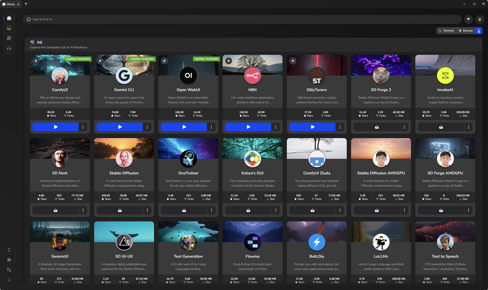

# [LynxHub](https://github.com/KindaBrazy/LynxHub) Local AI Collection

A collection of local AI tools with **full support** for **arguments**, **configurations**, and **extensions**.

## 🚀 Available Modules

### 🖼️ Image Generation

| Developer                                                                                          | Project                 | GitHub                                                                     |
| -------------------------------------------------------------------------------------------------- | ----------------------- | -------------------------------------------------------------------------- |
|  ComfyAnonymous  | ComfyUI                 | [Link](https://github.com/comfyanonymous/ComfyUI)                          |
|  Patientx          | ComfyUI Zluda           | [Link](https://github.com/patientx/ComfyUI-Zluda)                          |
|  Automatic1111    | Stable Diffusion        | [Link](https://github.com/AUTOMATIC1111/stable-diffusion-webui)            |
|  Lshqqytiger      | Stable Diffusion AMDGPU | [Link](https://github.com/lshqqytiger/stable-diffusion-webui-amdgpu)       |
|  Lllyasviel        | SD Forge                | [Link](https://github.com/lllyasviel/stable-diffusion-webui-forge)         |
|  Lshqqytiger      | SD Forge AMDGPU         | [Link](https://github.com/lshqqytiger/stable-diffusion-webui-amdgpu-forge) |
|  Vladmandic       | SD Next                 | [Link](https://github.com/vladmandic/automatic)                            |
|  McMonkeyProjects | SwarmUI                 | [Link](https://github.com/mcmonkeyprojects/SwarmUI)                        |
|  Bmaltais          | Kohya's GUI             | [Link](https://github.com/bmaltais/kohya_ss)                               |
|  Anapnoe         | SD UI-UX                | [Link](https://github.com/anapnoe/stable-diffusion-webui-ux)               |
|  Nerogar           | OneTrainer              | [Link](https://github.com/Nerogar/OneTrainer)                              |
|  InvokeAI        | InvokeAI                | [Link](https://github.com/invoke-ai/InvokeAI)                              |

### 📝 Text Generation

| Developer                                                                                          | Project         | GitHub                                                     |
| -------------------------------------------------------------------------------------------------- | --------------- | ---------------------------------------------------------- |
|  Oobabooga       | Text Generation | [Link](https://github.com/oobabooga/text-generation-webui) |
|  SillyTavern     | SillyTavern     | [Link](https://github.com/SillyTavern/SillyTavern)         |
|  Open-WebUI      | Open WebUI      | [Link](https://github.com/open-webui/open-webui)           |
|  StackBlitz Labs | bolt.diy        | [Link](https://github.com/stackblitz-labs/bolt.diy)        |
|  ParisNeo           | LoLLMs          | [Link](https://github.com/ParisNeo/lollms-webui)           |

### 🎵 Audio Generation

| Developer                                                                                 | Project          | GitHub                                                  |
| ----------------------------------------------------------------------------------------- | ---------------- | ------------------------------------------------------- |
|  Rsxdalv  | Text to Speech   | [Link](https://github.com/rsxdalv/tts-generation-webui) |
|  Gitmylo | Audio Generation | [Link](https://github.com/gitmylo/audio-webui)          |
|  Erew123 | AllTalk TTS      | [Link](https://github.com/erew123/alltalk_tts)          |

### 🤖 Agents

| Developer                                                                                        | Project    | GitHub                                              |
| ------------------------------------------------------------------------------------------------ | ---------- | --------------------------------------------------- |
|  FlowiseAI     | Flowise    | [Link](https://github.com/FlowiseAI/Flowise)        |
|  google-gemini | gemini-cli | [Link](https://github.com/google-gemini/gemini-cli) |
|  n8n-io         | n8n        | [Link](https://github.com/n8n-io/n8n)               |

### Tools

| Developer                                                                                    | Project                  | GitHub                                              |
| -------------------------------------------------------------------------------------------- | ------------------------ | --------------------------------------------------- |
|  ostris    | AI Toolkit               | [Link](https://github.com/ostris/ai-toolkit)        |
|  biagiomaf | SmartGallery for ComfyUI | [Link](https://github.com/biagiomaf/smart-comfyui-gallery) |
|  willmiao   | ComfyUI LoRA Manager     | [Link](https://github.com/willmiao/ComfyUI-Lora-Manager)               |
